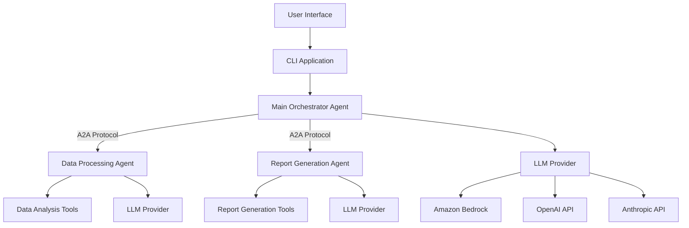
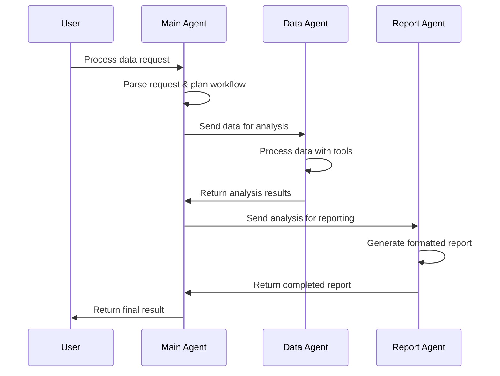
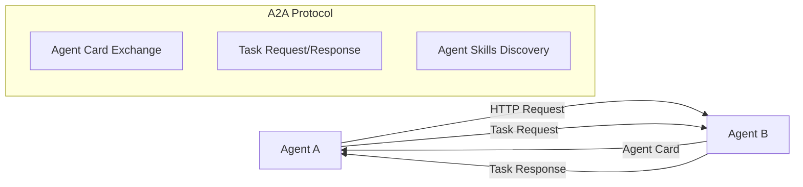

# System Architecture

This document outlines the technical architecture of the multi-agent system built with Strands Agents.

## 🏗️ High-Level Architecture



## 🔄 Agent Communication Flow

### Request Processing Sequence


### A2A Protocol Implementation


## 🧩 Component Architecture

### Agent Layer
```
┌─────────────────────────────────────────────────────────────┐
│                    Agent Layer                              │
├─────────────────┬─────────────────┬─────────────────────────┤
│  Main Agent     │  Data Agent     │  Report Agent           │
│  (Port 9000)    │  (Port 9001)    │  (Port 9002)           │
│                 │                 │                         │
│ • Orchestration │ • Data Analysis │ • Report Generation     │
│ • Workflow Mgmt │ • Statistics    │ • Template Rendering    │
│ • Error Handling│ • Validation    │ • Multi-format Export   │
└─────────────────┴─────────────────┴─────────────────────────┘
```

### Tool Layer
```
┌─────────────────────────────────────────────────────────────┐
│                    Tool Layer                               │
├─────────────────┬─────────────────┬─────────────────────────┤
│ Orchestration   │ Data Processing │ Report Generation       │
│ Tools           │ Tools           │ Tools                   │
│                 │                 │                         │
│ • Agent Discovery│ • CSV Parser   │ • PDF Generator         │
│ • Task Routing  │ • Statistics   │ • HTML Templates        │
│ • Result Merger │ • Data Cleaner │ • Chart Embedding       │
└─────────────────┴─────────────────┴─────────────────────────┘
```

### Infrastructure Layer
```
┌─────────────────────────────────────────────────────────────┐
│                Infrastructure Layer                         │
├─────────────────┬─────────────────┬─────────────────────────┤
│ Communication   │ Model Providers │ Configuration           │
│                 │                 │                         │
│ • A2A Protocol  │ • Amazon Bedrock│ • Environment Vars      │
│ • HTTP/REST     │ • OpenAI API    │ • Agent Settings        │
│ • Error Handling│ • Anthropic API │ • Tool Configuration    │
│ • Retry Logic   │ • Ollama Local  │ • Logging Setup         │
└─────────────────┴─────────────────┴─────────────────────────┘
```

## 🔧 Technical Implementation Details

### Agent Base Class Design
```python
from abc import ABC, abstractmethod
from typing import List, Dict, Any, Optional
from strands import Agent, tool
from strands.multiagent.a2a import A2AAgent

class BaseMultiAgent(ABC):
    """Base class for all agents in the system"""
    
    def __init__(
        self, 
        name: str, 
        description: str, 
        port: int,
        tools: Optional[List] = None
    ):
        self.name = name
        self.description = description
        self.port = port
        self.tools = tools or []
        
        # Create Strands agent
        self.strands_agent = Agent(
            name=name,
            description=description,
            tools=self.tools
        )
        
        # Wrap with A2A protocol
        self.a2a_agent = A2AAgent(
            self.strands_agent,
            port=port
        )
    
    @abstractmethod
    def process_request(self, request: Dict[str, Any]) -> Dict[str, Any]:
        """Process incoming requests - implement in subclasses"""
        pass
    
    def get_agent_card(self):
        """Return A2A agent card for discovery"""
        return self.a2a_agent.public_agent_card
    
    def start_server(self):
        """Start the A2A server for this agent"""
        self.a2a_agent.start()
```

### Communication Protocol
```python
class AgentCommunicator:
    """Handles inter-agent communication via A2A protocol"""
    
    def __init__(self, timeout: int = 30, max_retries: int = 3):
        self.timeout = timeout
        self.max_retries = max_retries
        self.known_agents = {}
    
    async def discover_agents(self) -> List[Dict]:
        """Discover available agents on the network"""
        # Implementation for agent discovery
        pass
    
    async def send_request(
        self, 
        target_agent: str, 
        task: str, 
        payload: Dict[str, Any]
    ) -> Dict[str, Any]:
        """Send request to target agent with retry logic"""
        # Implementation with exponential backoff
        pass
    
    async def broadcast_request(
        self, 
        task: str, 
        payload: Dict[str, Any]
    ) -> List[Dict[str, Any]]:
        """Send request to all known agents"""
        # Implementation for broadcast communication
        pass
```

### Configuration Management
```python
from pydantic import BaseSettings, Field
from typing import Optional, Dict, Any

class AgentConfig(BaseSettings):
    """Configuration for individual agents"""
    name: str
    description: str
    port: int
    model_provider: str = "bedrock"
    model_id: str = "anthropic.claude-3-sonnet-20240229-v1:0"
    tools: List[str] = Field(default_factory=list)

class SystemConfig(BaseSettings):
    """System-wide configuration"""
    # Agent configurations
    main_agent: AgentConfig
    data_agent: AgentConfig
    report_agent: AgentConfig
    
    # Communication settings
    agent_timeout: int = 30
    max_retries: int = 3
    discovery_interval: int = 60
    
    # LLM Provider settings
    aws_region: str = "us-west-2"
    openai_api_key: Optional[str] = None
    anthropic_api_key: Optional[str] = None
    
    # Logging configuration
    log_level: str = "INFO"
    log_format: str = "json"
    
    class Config:
        env_file = ".env"
        env_nested_delimiter = "__"
```

## 🔄 Data Flow Architecture

### Request Processing Pipeline
```
User Request
    ↓
CLI Parser
    ↓
Main Agent (Orchestrator)
    ↓
┌─────────────────────────────────┐
│     Workflow Planning           │
│ • Parse request requirements    │
│ • Identify required agents      │
│ • Plan execution sequence       │
└─────────────────────────────────┘
    ↓
┌─────────────────────────────────┐
│     Agent Coordination          │
│ • Send tasks to agents          │
│ • Monitor progress              │
│ • Handle errors/retries         │
└─────────────────────────────────┘
    ↓
┌─────────────────────────────────┐
│     Result Aggregation          │
│ • Collect agent responses       │
│ • Merge and validate results    │
│ • Format final output           │
└─────────────────────────────────┘
    ↓
Response to User
```

### Data Processing Flow
```
Raw Data Input
    ↓
Data Agent
    ↓
┌─────────────────────────────────┐
│     Data Validation             │
│ • Format verification           │
│ • Schema validation             │
│ • Quality checks                │
└─────────────────────────────────┘
    ↓
┌─────────────────────────────────┐
│     Data Processing             │
│ • Cleaning and normalization    │
│ • Statistical analysis          │
│ • Pattern detection             │
└─────────────────────────────────┘
    ↓
┌─────────────────────────────────┐
│     Insight Generation          │
│ • Summary statistics            │
│ • Key findings                  │
│ • Recommendations               │
└─────────────────────────────────┘
    ↓
Structured Analysis Results
```

## 🛡️ Security Architecture

### Agent Authentication
- Each agent has a unique identifier
- A2A protocol includes authentication schemes
- API keys managed through environment variables
- Network-level security for agent communication

### Data Security
- Input validation at all agent boundaries
- Sanitization of user inputs
- Secure handling of sensitive data
- Audit logging for all operations

### Network Security
- Agents communicate over HTTPS
- Port-based access control
- Rate limiting for agent requests
- Circuit breaker patterns for resilience

## 📊 Monitoring and Observability

### Metrics Collection
```python
class AgentMetrics:
    """Collect and expose agent performance metrics"""
    
    def __init__(self):
        self.request_count = 0
        self.response_times = []
        self.error_count = 0
        self.active_connections = 0
    
    def record_request(self, duration: float, success: bool):
        """Record request metrics"""
        self.request_count += 1
        self.response_times.append(duration)
        if not success:
            self.error_count += 1
    
    def get_metrics(self) -> Dict[str, Any]:
        """Return current metrics"""
        return {
            "requests_total": self.request_count,
            "avg_response_time": sum(self.response_times) / len(self.response_times),
            "error_rate": self.error_count / self.request_count,
            "active_connections": self.active_connections
        }
```

### Health Checks
- Agent availability monitoring
- Communication pathway validation
- Resource utilization tracking
- Performance threshold alerting

## 🚀 Scalability Considerations

### Horizontal Scaling
- Multiple instances of each agent type
- Load balancing across agent instances
- Service discovery for dynamic scaling
- Stateless agent design

### Performance Optimization
- Connection pooling for agent communication
- Caching of frequently used results
- Asynchronous processing where possible
- Resource-aware task scheduling

### Fault Tolerance
- Circuit breaker patterns
- Graceful degradation strategies
- Automatic failover mechanisms
- Data consistency guarantees

This architecture provides a solid foundation for building scalable, maintainable multi-agent systems while leveraging the strengths of the Strands Agents framework.
